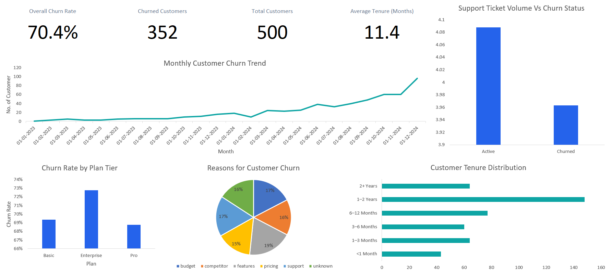

# Customer Retention & Churn Analysis (SaaS)

## 📌 Project Overview
This project focuses on analyzing **customer retention and churn behavior** for a SaaS-based subscription business.  
The objective is to understand **why customers leave**, **how long they stay**, and **which factors influence churn**, and to provide **actionable, business-focused recommendations**.

The analysis simulates real-world work performed by data analysts in **product, growth, and retention teams**.

---

## 🎯 Business Questions Addressed
- What is the overall customer churn rate?
- Which subscription plans experience higher churn?
- How long do customers typically remain active?
- What are the most common reasons for customer churn?
- Does customer support friction contribute to churn?
- How does churn trend over time?

---

## 🛠️ Tools & Technologies Used
- **Python (Pandas, NumPy)** – Data cleaning, transformation, and analysis  
- **Microsoft Excel** – Dashboard creation and visualization  
- **Jupyter Notebook** – Analytical workflow  
- **GitHub** – Project documentation and version control  

---

## 📊 Key Analysis & Dashboard Components
The final Excel dashboard includes:
- Churn rate by subscription plan
- Customer tenure distribution
- Monthly churn trend (line chart)
- Churn reasons breakdown (donut chart)
- Support tickets vs churn comparison
- KPI summary displayed using Power BI–style text cards

---

## 🔍 Key Insights
- A large portion of churn occurs within the **first 1–3 months**, indicating onboarding and early engagement are critical.
- **Basic plan customers** show higher churn compared to higher-tier plans.
- Customers who stay beyond **6 months** have significantly better retention.
- Higher support ticket volume and longer resolution times are associated with increased churn.
- Churn levels fluctuate monthly, suggesting influence from product, pricing, or seasonal factors.
- Pricing and feature-related issues are among the most common churn reasons.

---

## 📈 Actionable Recommendations
- Improve onboarding experience during the **first 90 days** to reduce early churn.
- Re-evaluate value proposition and feature access for **Basic plan customers**.
- Proactively identify and support customers with increasing support ticket activity.
- Monitor churn trends monthly to detect early warning signals.
- Introduce targeted retention strategies for customers approaching high-risk tenure periods.

---

## 📂 Project Structure
FUTURE_DS_02/
│
├── notebooks/
│ └── customer_churn_retention_analysis.ipynb
│
├── excel_files/
│ └── Customer_Retention_Churn_Dashboard.xlsx
│
├── screenshots/
│ └── dashboard.png
│
├── data/
│ └── README.md
│
├── output/
│ └── *.csv
│
└── README.md

---

## 📸 Dashboard Preview

---

## 📌 Notes
- The dataset used in this project is not included due to licensing and size constraints.
- This project was completed as part of the **Data Science & Analytics Internship Program** and reflects real-world SaaS retention analysis practices.

---

## 👤 Author
**Bhavesh Balaram Lambar**  
Aspiring Data Analyst | Data Science & Analytics Intern
